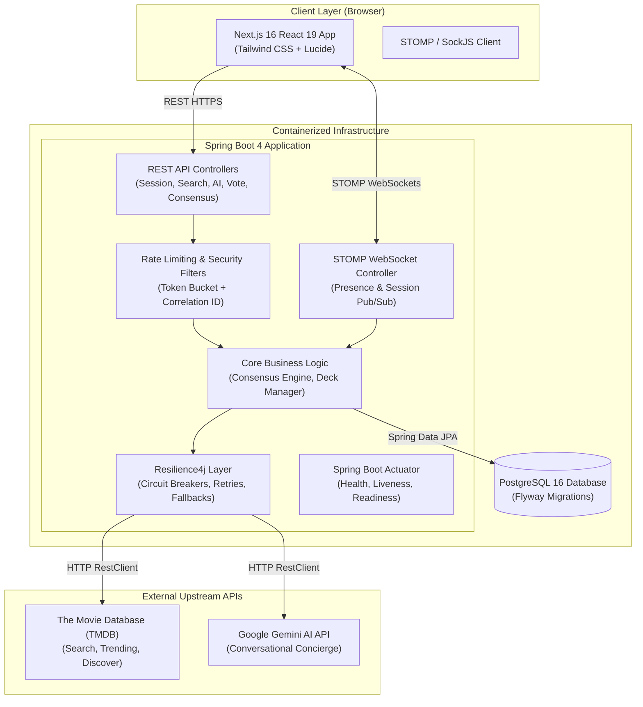

# Movie Picker

A real-time collaborative movie discovery and consensus platform built with Next.js 16, Spring Boot 4, PostgreSQL, STOMP WebSockets, Resilience4j, and Google Gemini AI.

---

## Table of Contents
- [System Architecture](#system-architecture)
- [Key Features](#key-features)
- [Technology Stack](#technology-stack)
- [Prerequisites & API Keys](#prerequisites--api-keys)
- [Quickstart with Docker](#quickstart-with-docker)
- [Manual Local Setup](#manual-local-setup)
- [Configuration Reference](#configuration-reference)
- [REST API Reference](#rest-api-reference)
- [WebSocket API Reference](#websocket-api-reference)
- [Resilience & Observability](#resilience--observability)
- [Testing & Quality Assurance](#testing--quality-assurance)

---

## System Architecture

Movie Picker follows a decoupled, three-tier architecture with real-time bidirectional synchronization over WebSockets and fault-tolerant upstream service integrations.



---

## Key Features

### 1. Multi-Stage Session Workflow
- **Lobby Stage**: Host configures room parameters (max players, nomination limits), generates a unique 6-character room code, and manages participants with real-time kick/ban capabilities.
- **Search & Nomination Stage**: Participants search the TMDB catalog or use the **Vibe Matcher** filter tool to curate nominations.
- **AI Concierge ("I'm Lost")**: Multi-turn conversational recommendations powered by Google Gemini, returning structured suggestions that can be nominated directly.
- **Tinder-Style Swiper Stage**: Participants vote on the aggregated movie deck using keyboard navigation (`A` for Skip, `D` for Like, `W` for Superlike) or touch swipe gestures.
- **Consensus & Winner Stage**: Instant weighted consensus scoring with podium rankings, vote breakdown statistics, and streaming provider availability.

### 2. Weighted Consensus Engine
The consensus algorithm calculates movie popularity using weighted vote values:
- **SUPERLIKE**: +3 points
- **YES**: +2 points
- **LIKE**: +1 point
- **SKIP / NO / PASS**: 0 points

Ties are resolved deterministically using TMDB vote averages and release dates.

### 3. Real-Time WebSocket Synchronization
- Built on STOMP over SockJS (`/ws`).
- Automatic presence tracking and disconnection detection with a 5-second reconnect grace period to preserve room memberships across network blips.
- Instant topic broadcasting for stage transitions, member departures, vote counters, and readiness status.

### 4. Enterprise Resilience & Observability
- **Resilience4j Fault Tolerance**: Dedicated circuit breakers and exponential backoff retries for external TMDB and Gemini AI integrations. Upstream outages automatically trigger graceful fallback responses rather than server errors.
- **MDC Correlation ID Tracing**: Unique `X-Correlation-ID` header injection across all incoming HTTP requests and STOMP frames for distributed log traceability.
- **Spring Boot Actuator**: Health, liveness, and readiness probes exposed at `/actuator/health`.

### 5. Production-Optimized Containerization
- **Backend**: Multi-stage build leveraging Spring Boot `layertools` (`dependencies`, `spring-boot-loader`, `snapshot-dependencies`, `application`) on `eclipse-temurin:17-jre-alpine` with an unprivileged `spring` user (~180MB compressed).
- **Frontend**: Next.js `output: 'standalone'` mode on `node:20-alpine` with an unprivileged `nextjs` user (~73MB compressed).

---

## Technology Stack

| Layer | Technologies |
|---|---|
| **Frontend** | Next.js 16 (App Router), React 19, TypeScript, Tailwind CSS, Lucide Icons, Canvas Confetti |
| **Backend** | Spring Boot 4.1.0, Java 17, Spring Data JPA, Spring Security, Spring WebSocket / STOMP |
| **Resilience & Observability** | Resilience4j 2.2.0, Spring Boot Actuator, SLF4J / MDC Tracing |
| **Database** | PostgreSQL 16 (Production / Docker), H2 In-Memory (Test Suite), Flyway Migrations |
| **Containerization** | Docker, Multi-Stage Dockerfiles, Docker Compose |
| **External APIs** | The Movie Database (TMDB) API v3/v4, Google Gemini AI API (`gemini-3.5-flash-lite`) |
| **Testing** | JUnit 5, Mockito, AssertJ, Vitest, Testing Library, Happy-DOM |

---

## Prerequisites & API Keys

### 1. Required API Keys

#### The Movie Database (TMDB) API Key
1. Register for a free account at [themoviedb.org](https://www.themoviedb.org/).
2. Navigate to **Account Settings > API** at [https://www.themoviedb.org/settings/api](https://www.themoviedb.org/settings/api).
3. Request an API key and copy the **API Key (v3 auth)** or the **API Read Access Token (v4 auth)**.

#### Google Gemini AI API Key
1. Sign in to [Google AI Studio](https://aistudio.google.com/).
2. Click **Get API Key** and generate a new API key.

### 2. Where to Place the Keys

- **For Docker Compose**: Place keys in the root `.env` file (see below).
- **For Manual Local Setup**: Export them in your terminal or configure them in `backend/src/main/resources/application.properties`.

---

## Quickstart with Docker

The fastest way to launch the complete 3-tier application (PostgreSQL, Backend, Frontend) is with Docker Compose.

### Step 1: Clone the Repository
```bash
git clone https://github.com/your-username/movie-picker.git
cd movie-picker
```

### Step 2: Create Environment Configuration
Copy the template to `.env`:
```bash
cp .env.example .env
```

Open `.env` and insert your API keys:
```dotenv
TMDB_API_KEY=your_tmdb_api_key_here
GEMINI_API_KEY=your_gemini_api_key_here
```

### Step 3: Start the Containers
```bash
docker compose up -d
```

### Step 4: Access the Application
- **Frontend UI**: [http://localhost:3000](http://localhost:3000)
- **Backend REST & Actuator**: [http://localhost:8080/actuator/health](http://localhost:8080/actuator/health)
- **PostgreSQL Database**: `localhost:5432` (`moviepicker` / `supersecretpassword123`)

### Step 5: Stop the Containers
```bash
docker compose down
```

---

## Manual Local Setup

If you prefer to run services individually without Docker:

### 1. PostgreSQL Database
Ensure a local PostgreSQL instance is running on port `5432`:
```sql
CREATE DATABASE moviepicker;
CREATE USER postgres WITH PASSWORD 'supersecretpassword123';
GRANT ALL PRIVILEGES ON DATABASE moviepicker TO postgres;
```

### 2. Backend Setup
```bash
cd backend

# On Linux/macOS
export TMDB_API_KEY="your_tmdb_api_key"
export GEMINI_API_KEY="your_gemini_api_key"
./mvnw spring-boot:run

# On Windows (PowerShell)
$env:TMDB_API_KEY="your_tmdb_api_key"
$env:GEMINI_API_KEY="your_gemini_api_key"
.\mvnw.cmd spring-boot:run
```
The backend will initialize database tables via Flyway and start on port `8080`.

### 3. Frontend Setup
```bash
cd frontend

# Install dependencies
npm install

# Start development server
npm run dev
```
The frontend will start on [http://localhost:3000](http://localhost:3000).

---

## Configuration Reference

The following environment variables can be configured in `.env` or system environment:

| Variable | Default Value | Description |
|---|---|---|
| `TMDB_API_KEY` | None | TMDB API v3 Key (Required for search and trending) |
| `TMDB_READ_ACCESS_TOKEN` | None | TMDB API Read Access Token v4 (Optional alternative to API Key) |
| `GEMINI_API_KEY` | None | Google Gemini AI Key (Required for AI Concierge) |
| `GEMINI_MODEL` | `gemini-3.5-flash-lite` | Gemini model name |
| `POSTGRES_DB` | `moviepicker` | PostgreSQL database name |
| `POSTGRES_USER` | `postgres` | PostgreSQL username |
| `POSTGRES_PASSWORD` | `supersecretpassword123` | PostgreSQL password |
| `POSTGRES_PORT` | `5432` | PostgreSQL host port |
| `BACKEND_PORT` | `8080` | Spring Boot HTTP port |
| `FRONTEND_PORT` | `3000` | Next.js HTTP port |
| `NEXT_PUBLIC_API_URL` | `http://localhost:8080` | Client-facing backend REST API base URL |
| `NEXT_PUBLIC_WS_URL` | `http://localhost:8080/ws` | Client-facing STOMP WebSocket URL |
| `RATE_LIMIT_ENABLED` | `true` | Enables per-IP Token Bucket rate limiting |

---

## REST API Reference

All REST endpoints are prefixed with `/api/v1`.

### Sessions (`/api/v1/sessions`)
| Method | Endpoint | Description |
|---|---|---|
| `POST` | `/api/v1/sessions` | Create a new room session (returns room code and host token) |
| `POST` | `/api/v1/sessions/join` | Join an existing room using a 6-character room code |
| `GET` | `/api/v1/sessions/{roomCode}` | Get session details and active user roster |
| `POST` | `/api/v1/sessions/{roomCode}/leave` | Leave a room session |
| `POST` | `/api/v1/sessions/{roomCode}/start-search` | Transition room stage to SEARCH (Host only) |
| `POST` | `/api/v1/sessions/{roomCode}/start-voting` | Transition room stage to SWIPER (Host only) |
| `POST` | `/api/v1/sessions/{roomCode}/kick` | Kick or ban a user from the room (Host only) |

### Movie Discovery & Search (`/api/v1/movies`)
| Method | Endpoint | Description |
|---|---|---|
| `GET` | `/api/v1/movies/search?query={q}&page={p}` | Search movies by keyword with caching |
| `GET` | `/api/v1/movies/trending?page={p}` | Retrieve weekly trending movies |
| `GET` | `/api/v1/movies/discover` | Multi-filter discovery (genre, provider, decade, rating, runtime) |
| `GET` | `/api/v1/movies/{tmdbId}` | Get detailed movie metadata, cast, and streaming providers |
| `POST` | `/api/v1/movies/nominations` | Submit nominated movie deck for a user in a room |
| `GET` | `/api/v1/movies/nominations/{roomCode}` | Retrieve aggregated room movie deck |

### AI Concierge (`/api/v1/ai`)
| Method | Endpoint | Description |
|---|---|---|
| `POST` | `/api/v1/ai/recommendations` | Generate conversational recommendations from Gemini |

### Voting & Consensus (`/api/v1/votes`, `/api/v1/consensus`)
| Method | Endpoint | Description |
|---|---|---|
| `POST` | `/api/v1/votes` | Cast a vote on a movie (`YES`, `NO`, `LIKE`, `SUPERLIKE`, `SKIP`) |
| `GET` | `/api/v1/consensus/{roomCode}` | Calculate and retrieve real-time consensus results |
| `GET` | `/api/v1/consensus/{roomCode}/winner` | Retrieve winning movie and leaderboard rankings |

### Observability & Health (`/actuator`)
| Method | Endpoint | Description |
|---|---|---|
| `GET` | `/actuator/health` | Comprehensive application, database, and circuit breaker health |
| `GET` | `/actuator/info` | Build and application metadata |

---

## WebSocket API Reference

Real-time events communicate over STOMP via `/ws`.

### Subscribe Channels
| Topic | Description |
|---|---|
| `/topic/session/{roomCode}` | Broadcasts room stage transitions, member join/leave, kick events, and vote tallies |
| `/topic/session/{roomCode}/presence` | Broadcasts user heartbeat and active presence states |

### Publish Endpoints
| Destination | Payload | Description |
|---|---|---|
| `/app/session/{roomCode}/presence` | `{ userId, status }` | Emits user presence ping |
| `/app/session/{roomCode}/vote` | `{ userId, movieSuggestionId, voteType }` | Emits live vote event |

---

## Resilience & Observability

### Circuit Breakers & Retries
External dependencies are guarded by Resilience4j:
- **`geminiApi`**: Sliding window of 10 calls, 50% failure threshold, 10s wait duration in open state, 3 retry attempts with exponential backoff (multiplier 2x).
- **`tmdbApi`**: Sliding window of 10 calls, 50% failure threshold, 10s wait duration in open state, 3 retry attempts with exponential backoff.

### MDC Correlation Tracing
Every HTTP request generates or accepts an `X-Correlation-ID` header, which is injected into SLF4J MDC context and propagated across log statements and response headers:
```text
2026-08-23 16:10:05.123 [http-nio-8080-exec-1] [f38a19bc-48d0-421c-8e3b-123456789abc] INFO  c.m.b.service.MovieSearchServiceImpl - Executing TMDB trending movies for page=1
```

---

## Testing & Quality Assurance

### Run Backend Tests (174 Tests)
```bash
cd backend
./mvnw clean test
```

### Run Frontend Tests (237 Tests)
```bash
cd frontend
npm test
```

### Run Frontend TypeScript Validation
```bash
cd frontend
npx tsc --noEmit
```

---

## License
This project is licensed under the MIT License.