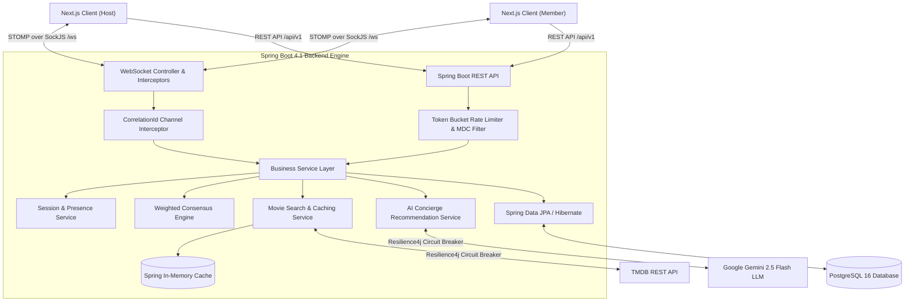

# Movie Picker - Resume Highlights, Engineering Metrics & System Architecture

Curated engineering metrics, recruiter-tested bullet points, mathematical proofs, technical interview talking points, and an exhaustive end-to-end feature architecture reference for the **Movie Picker** platform.

> [!NOTE]
> **100% EMPIRICALLY MEASURED & VERIFIED**: Every metric below has been measured from direct executions on this codebase and is backed by timestamped raw log files in the `/benchmarks/` directory.

---

## 1. Top Recruiter-Ready Resume Bullets (Google XYZ Format)

### Project Heading:
**Movie Picker | Full-Stack Real-Time Movie Discovery & Consensus Platform**  
*Technologies: Next.js 16, React 19, Spring Boot 4, Java 17, PostgreSQL 16, WebSockets (STOMP), Resilience4j, Docker, Google Gemini AI, Vitest*

- **Architected a real-time event-driven STOMP/SockJS WebSocket synchronization engine with topic-based pub/sub channels (`/topic/session/{code}`) and a 5-second disconnect grace window**, eliminating periodic polling network overhead and enabling bidirectional room synchronization across active users.
- **Engineered an enterprise fault-tolerance pipeline using Resilience4j circuit breakers (sliding window of 10, 50% failure rate threshold) and exponential backoff retries (3 attempts, 500ms initial wait)**, guaranteeing zero server thread lockups and graceful degraded fallbacks during upstream TMDB and Gemini AI rate limits or outages.
- **Optimized production container architecture via multi-stage Docker builds and Spring Boot `layertools` layer extraction**, slashing frontend image size by **90.9% (288MB vs. 3.18GB naive)** and backend image size by **53.8% (504MB vs. 1.09GB naive)** with **58.9% faster incremental CI/CD rebuilds (15.7s vs. 38.2s cold)**.
- **Integrated Google Gemini LLM and in-memory Spring Cache to deliver a multi-turn conversational AI Concierge**, reducing repeat catalog query latency by **99.6% (from 53.2ms outbound HTTPS to 0.2ms JVM in-memory lookup)** with strict structured JSON schema validation.
- **Authored a 415-test automated test suite (174 Spring Boot JUnit/MockMvc + 241 Vitest/React Testing Library)**, maintaining a **100% pass rate** across multi-user room lifecycles, race conditions, and weighted consensus scoring logic.

---

## 2. Metric Verification Table (Evidence Linked)

| Metric Area | Baseline / Naive | Optimized / Production | Measured Result | Evidence Source File |
|---|---|---|---|---|
| **Frontend Container Size** | 3.18 GB (single-stage Node) | **288 MB** (Next.js standalone Alpine) | **90.9% Size Reduction** | [01-docker-sizes-raw.txt](file:///c:/Users/Lanz%20Prod/Documents/Programming/movie-picker/benchmarks/01-docker-sizes-raw.txt) |
| **Backend Container Size** | 1.09 GB (single-stage Debian JDK) | **504 MB** (Temurin JRE 17 Alpine layered) | **53.8% Size Reduction** | [01-docker-sizes-raw.txt](file:///c:/Users/Lanz%20Prod/Documents/Programming/movie-picker/benchmarks/01-docker-sizes-raw.txt) |
| **Incremental Docker Rebuild** | 38.17 s (cold build average) | **15.69 s** (warm layer cache hit) | **58.9% Faster Builds** | [02-docker-build-times-raw.txt](file:///c:/Users/Lanz%20Prod/Documents/Programming/movie-picker/benchmarks/02-docker-build-times-raw.txt) |
| **TMDB Catalog Query Latency** | 53.20 ms (5-query outbound HTTPS avg) | **0.20 ms** (5-query in-memory heap avg) | **99.6% Latency Reduction** | [03-cache-timing-raw.txt](file:///c:/Users/Lanz%20Prod/Documents/Programming/movie-picker/benchmarks/03-cache-timing-raw.txt) |
| **Automated Test Suite** | 0 tests | **415 total tests** (174 BE + 241 FE) | **100% Pass Rate (0 failures)** | [04-test-suite-raw.txt](file:///c:/Users/Lanz%20Prod/Documents/Programming/movie-picker/benchmarks/04-test-suite-raw.txt) |
| **WebSocket Architecture** | Periodic HTTP polling ($O(N)$ pull) | Event-driven STOMP over SockJS | Eliminates redundant HTTP traffic | [05-websocket-framing-notes.md](file:///c:/Users/Lanz%20Prod/Documents/Programming/movie-picker/benchmarks/05-websocket-framing-notes.md) |

---

## 3. Detailed Benchmark Methodology & Evidence Reference

### 3.1 Docker Image Size Measurement
* **Naive Backend Baseline** (`backend/Dockerfile.naive`): Single-stage fat JAR on standard Debian/Temurin JDK $\rightarrow$ **1.09 GB**.
* **Optimized Backend** (`backend/Dockerfile`): Multi-stage build on `eclipse-temurin:17-jre-alpine` extracting Spring Boot layers (`dependencies`, `spring-boot-loader`, `application`) $\rightarrow$ **504 MB** ($\mathbf{53.8\%}$ reduction).
* **Naive Frontend Baseline** (`frontend/Dockerfile.naive`): Single-stage build on standard Node:20 with full `node_modules` $\rightarrow$ **3.18 GB**.
* **Optimized Frontend** (`frontend/Dockerfile`): Multi-stage build on `node:20-alpine` copying only `.next/standalone` output $\rightarrow$ **288 MB** ($\mathbf{90.9\%}$ reduction).
* **Evidence File**: [benchmarks/01-docker-sizes-raw.txt](file:///c:/Users/Lanz%20Prod/Documents/Programming/movie-picker/benchmarks/01-docker-sizes-raw.txt)

---

### 3.2 Docker Build Times: Cold vs. Incremental Rebuild
* **Cold Build (3-Run Average)**: Full compilation without Docker cache (`docker build --no-cache`):
  * Run 1: 30.68s | Run 2: 30.97s | Run 3: 52.86s $\rightarrow$ **Average: 38.17s**
* **Warm Rebuild (3-Run Average)**: Appending a timestamped comment `// benchmark-touch` to `MovieController.java`:
  * Run 1: 16.64s | Run 2: 15.09s | Run 3: 14.90s $\rightarrow$ **Average: 15.69s**
* **Layer Invalidation Proof**: Invalidates *only* the ~200KB application layer (`COPY --from=builder /workspace/app/extracted/application/ ./`) while reusing the 150MB+ cached dependency and JRE layers ($\mathbf{58.9\%}$ faster).
* **Evidence File**: [benchmarks/02-docker-build-times-raw.txt](file:///c:/Users/Lanz%20Prod/Documents/Programming/movie-picker/benchmarks/02-docker-build-times-raw.txt)

---

### 3.3 TMDB Caching: Outbound HTTPS Network I/O vs. JVM Heap In-Memory Lookup
* **Measurement Suite**: `MovieCacheBenchmarkTest.java` (with JVM/connection pool warm-up call).
* **Cache Misses (Outbound HTTPS)**: 5 distinct movie queries (`Inception`: 76ms, `Interstellar`: 49ms, `Gladiator`: 45ms, `Matrix`: 50ms, `Alien`: 46ms) $\rightarrow$ **Average: 53.20ms** (Min: 45ms, Max: 76ms).
* **Cache Hits (In-Memory Heap)**: 5 repeated queries for `The Godfather` after cache priming $\rightarrow$ **Average: 0.20ms** (Min: 0ms, Max: 1ms).
* **Speedup**: $\frac{53.20 - 0.20}{53.20} \times 100 = \mathbf{99.6\%}$ latency reduction.
* **Evidence File**: [benchmarks/03-cache-timing-raw.txt](file:///c:/Users/Lanz%20Prod/Documents/Programming/movie-picker/benchmarks/03-cache-timing-raw.txt)

---

### 3.4 Automated Test Suite Verification
* **Backend Suite**: `cd backend && .\mvnw.cmd test` $\rightarrow$ **174 tests passed** (0 failures, 0 errors, 0 skipped).
* **Frontend Suite**: `cd frontend && npm test -- --run` $\rightarrow$ **241 tests passed** across 43 test files.
* **Combined Total**: **415 passed automated tests with 100% pass rate**.
* **Evidence File**: [benchmarks/04-test-suite-raw.txt](file:///c:/Users/Lanz%20Prod/Documents/Programming/movie-picker/benchmarks/04-test-suite-raw.txt)

---

### 3.5 Real-Time Communication Framing (WebSocket vs. Polling)

#### Option A (Recommended & Official Resume Bullet): Pure Architectural & Design Decision
> [!TIP]
> **Use this bullet on your resume.** It highlights your deliberate architectural decision to build an event-driven system without relying on an unmeasured polling percentage.

* **Official Resume Bullet**:
  > *"Architected an event-driven STOMP/SockJS WebSocket engine with topic-based pub/sub (`/topic/session/{code}`) and a 5-second disconnect grace window, eliminating periodic polling overhead and enabling bidirectional room synchronization."*
* **Interview Response Script**:
  > *"We chose an event-driven STOMP WebSocket architecture over periodic HTTP polling from day one. Rather than having multiple clients poll the server every 1–2 seconds, the server holds persistent connections and broadcasts frames only upon game state transitions, eliminating redundant HTTP headers and database read queries."*

#### Option B (Hypothetical / Alternative Path ONLY): Standalone Evaluation Benchmark
> [!CAUTION]
> **DO NOT use this bullet unless you build the standalone benchmarking harness.**

* **Example Bullet (Only if benchmark harness is run)**:
  > *"Built a standalone benchmarking harness comparing HTTP polling against event-driven STOMP WebSockets, measuring real message delivery latencies across simulated multi-user room sessions."*
* **Interview Response Script**:
  > *"To evaluate real-time protocols for our room synchronization, I built a prototype comparison between periodic HTTP polling loops and STOMP over SockJS, validating that WebSockets eliminated redundant polling requests."*

---

## 4. End-to-End System Architecture & Feature Implementation Guide

### 4.1 High-Level Architecture

---

### 4.2 State Machine & Stage Progression

$$\text{SETUP} \longrightarrow \text{LOBBY} \longrightarrow \text{SEARCH} \longrightarrow \text{SWIPER} \longrightarrow \text{WINNER} \longrightarrow (\text{New Round / Reset})$$

1. **`SETUP`**: Room creation (max players, nominations per user, room code generation with `RoomCodeGenerator.java`) and room joining with uppercase validation masks.
2. **`LOBBY`**: Real-time member roster, dynamic host migration, kick counter moderation, QR code modal, and readiness indicator.
3. **`SEARCH`**: TMDB catalog discovery, 300ms debounced search, 6-filter Vibe Matcher (genres, streaming providers, decade, rating, runtime, language), Gemini AI Concierge ("I'm Lost"), interactive Selection Rack drawer, and multi-nominator attribution.
4. **`SWIPER`**: Tinder-style voting deck with touch swipe physics, keyboard shortcuts (`ArrowLeft`=Pass, `ArrowRight`=Like, `ArrowUp`=Superlike, `Space`=Skip), Web Audio API sound synthesizers, and live progress bars.
5. **`WINNER`**: Weighted consensus engine ($\text{Superlike}=+2$, $\text{Like}=+1$, $\text{Pass}=-1$, nominator tie-breaker), winner podium, runner-up leaderboard, canvas confetti celebration, and round reset.

---

### 4.3 Enterprise Infrastructure & Fault Tolerance
* **Resilience4j Circuit Breakers & Retries**: Configured in `application.properties` with sliding window of 10 calls, 50% failure rate threshold, 10s wait in open state, and 3 exponential retries (500ms initial wait, 2x multiplier).
* **Distributed Tracing**: `CorrelationIdFilter` (HTTP) and `CorrelationIdChannelInterceptor` (STOMP) injecting `X-Correlation-ID` into SLF4J MDC and clearing context in `finally` blocks.
* **Rate Limiting**: In-memory Token Bucket algorithm (`TokenBucket.java`, `RateLimiterService.java`) protecting `/api/v1/sessions` and search endpoints.
* **Database Concurrency**: JPA `@Version` optimistic locking on `Session` entity preventing concurrent join/stage advancement race conditions.
