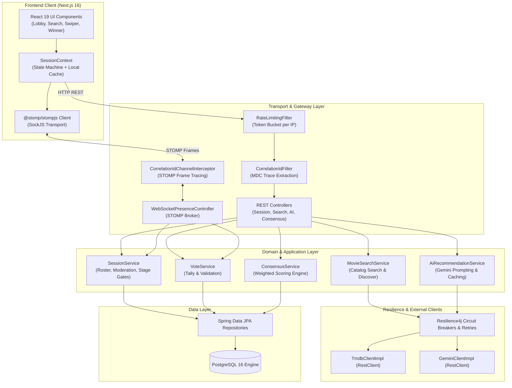
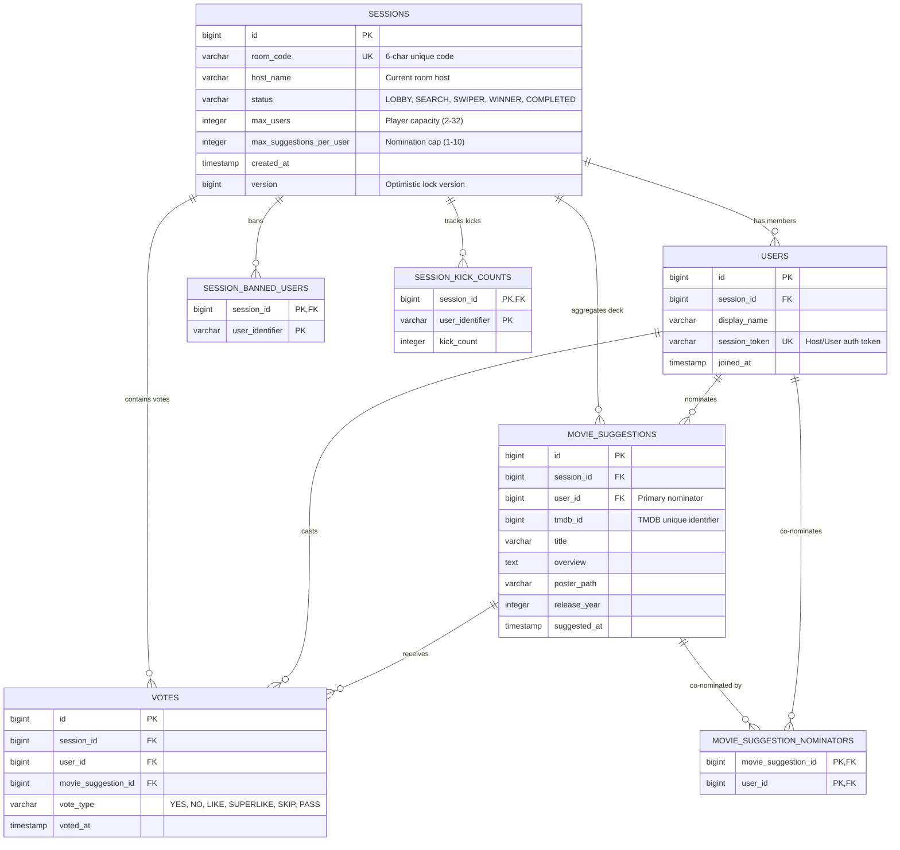
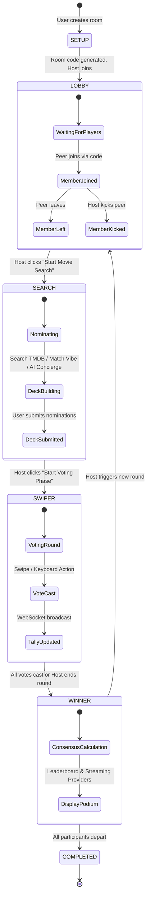
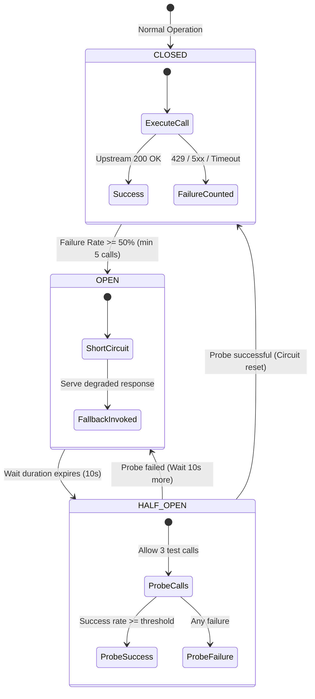

# Movie Picker - System Architecture

Comprehensive architectural specification detailing database schema design, room lifecycle state machines, real-time WebSocket communication flows, weighted consensus calculations, and resilience engineering.

---

## Table of Contents
- [Layered Architecture](#layered-architecture)
- [Database Schema (Entity-Relationship Model)](#database-schema-entity-relationship-model)
- [Room Stage State Machine](#room-stage-state-machine)
- [Real-Time WebSocket Protocol & Sequence](#real-time-websocket-protocol--sequence)
- [Weighted Consensus Algorithm](#weighted-consensus-algorithm)
- [Fault Tolerance & Circuit Breaking Topology](#fault-tolerance--circuit-breaking-topology)
- [Distributed Tracing (MDC)](#distributed-tracing-mdc)

---

## Layered Architecture

Movie Picker employs a strict separation of concerns across presentation, transport, domain, persistence, and external service layers:



---

## Database Schema (Entity-Relationship Model)

The database schema is managed via Flyway versioned migrations and normalized for transactional integrity and low-latency queries during high-concurrency voting rounds.



### Key Schema Constraints
- **`uk_user_movie_vote`**: Unique constraint on `(user_id, movie_suggestion_id)` preventing duplicate votes by the same participant on the same movie.
- **Database Indexes**: Dedicated indexes on `(session_id)`, `(session_id, user_id)`, and `(session_id, movie_suggestion_id)` ensure sub-millisecond lookups during real-time score calculation.

---

## Room Stage State Machine

A room transitions sequentially through strict stage boundaries governed by host authorization:



---

## Real-Time WebSocket Protocol & Sequence

The real-time synchronization layer uses STOMP over SockJS to broadcast room events without polling:

```mermaid
sequenceDiagram
    autonumber
    actor Host as Host Client
    actor Peer as Peer Client
    participant WS as WebSocket Controller (STOMP)
    participant Core as Session & Vote Service
    participant DB as PostgreSQL Database

    Note over Host,DB: 1. Room Creation & Connection
    Host->>WS: CONNECT /ws (X-Correlation-ID: trace-001)
    WS-->>Host: CONNECTED
    Host->>WS: SUBSCRIBE /topic/session/SFFMU1

    Note over Peer,DB: 2. Peer Joins Room
    Peer->>WS: CONNECT /ws (X-Correlation-ID: trace-002)
    WS-->>Peer: CONNECTED
    Peer->>WS: SUBSCRIBE /topic/session/SFFMU1
    Peer->>Core: POST /api/v1/sessions/join
    Core->>DB: INSERT into users
    Core->>WS: Broadcast MemberJoined to /topic/session/SFFMU1
    WS-->>Host: MemberJoined Event (Roster updated)
    WS-->>Peer: MemberJoined Event (Roster updated)

    Note over Host,DB: 3. Stage Advancement to SWIPER
    Host->>Core: POST /api/v1/sessions/SFFMU1/start-voting
    Core->>DB: UPDATE sessions SET status = 'SWIPER'
    Core->>WS: Broadcast StageChange (SWIPER)
    WS-->>Host: StageChange (Navigate to Swiper)
    WS-->>Peer: StageChange (Navigate to Swiper)

    Note over Host,DB: 4. Real-Time Swipe Voting
    Peer->>Core: POST /api/v1/votes (SUPERLIKE on Movie 550)
    Core->>DB: INSERT into votes
    Core->>WS: Broadcast VoteProgress (userCount, submittedCount)
    WS-->>Host: VoteProgress Update
    WS-->>Peer: VoteProgress Update

    Note over Host,DB: 5. Disconnection & Reconnection Grace Window
    Peer--xWS: Network Disconnection
    WS->>Core: Handle SessionDisconnectEvent
    Note right of Core: Start 5-second grace timer
    Peer->>WS: Reconnect within 3 seconds
    Core->>Core: Cancel grace timer; Preserve session token
```

---

## Weighted Consensus Algorithm

When calculating final rankings and the winning movie, each vote cast by a participant is weighted:

### Vote Weights
| Vote Type | Point Value | Semantic Meaning |
|---|---|---|
| `SUPERLIKE` | **+3** | Absolute favorite selection |
| `YES` | **+2** | Strong approval |
| `LIKE` | **+1** | Moderate approval |
| `SKIP` | **0** | Neutral / Passed |
| `NO` | **0** | Disapproval |
| `PASS` | **0** | Neutral pass |

### Consensus Scoring Formula
For each movie suggestion $M$ in room $S$:

$$\text{Total Score}(M) = \sum_{v \in \text{Votes}(M)} \text{Weight}(v.\text{type})$$

$$\text{Approval Percentage}(M) = \frac{\text{Count}(\text{Positive Votes})}{\text{Total Room Participants}} \times 100$$

### Deterministic Tie-Breaking
If two or more movies achieve identical Total Scores, ties are resolved in the following priority:
1. **Higher Superlike Count** ($\text{Count}(\text{SUPERLIKE})$)
2. **Higher TMDB Vote Average** ($\text{VoteAverage}$)
3. **Higher Total Vote Count on TMDB** ($\text{VoteCount}$)
4. **Earlier Release Date** ($\text{ReleaseDate}$)

---

## Fault Tolerance & Circuit Breaking Topology

All external third-party API dependencies (TMDB API and Google Gemini API) are isolated behind Resilience4j circuit breakers and exponential backoff retry layers:



### Configured Instances
- **`geminiApi`**: Sliding window of 10 calls, 50% failure rate threshold, 10-second open duration, 3 retry attempts with base backoff 500ms and 2x exponential multiplier.
- **`tmdbApi`**: Sliding window of 10 calls, 50% failure rate threshold, 10-second open duration, 3 retry attempts with base backoff 500ms and 2x exponential multiplier.

---

## Distributed Tracing (MDC)

To trace requests end-to-end across asynchronous execution boundaries, threads, and WebSocket sessions:

1. **HTTP Ingestion**: `CorrelationIdFilter` intercepts incoming HTTP requests. If the request carries an `X-Correlation-ID` header, that ID is preserved; otherwise, a UUID is generated.
2. **MDC Population**: The trace ID is stored in SLF4J MDC under key `traceId`.
3. **Console Logging**: Configured via Spring Boot console pattern `%X{traceId:-}`, stamping every log entry with `[traceId]`.
4. **Response Injection**: The trace ID is returned in the HTTP response header `X-Correlation-ID`.
5. **WebSocket Propagation**: `CorrelationIdChannelInterceptor` inspects native STOMP frame headers on `CONNECT` and `SEND`, transferring the trace ID into session attributes and MDC for background thread dispatch.
6. **Thread Hygiene**: All filters and interceptors clear MDC in `finally` blocks, preventing trace contamination across reusable thread pools.
